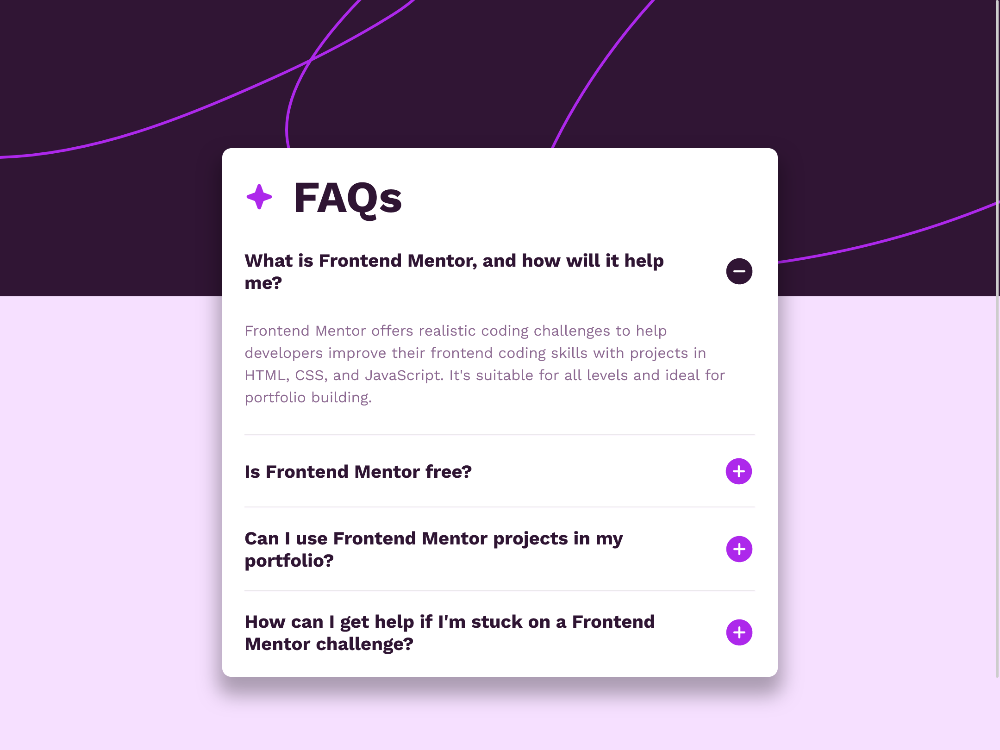

# Frontend Mentor - FAQ accordion solution

This is a solution to the [FAQ accordion challenge on Frontend Mentor](https://www.frontendmentor.io/challenges/faq-accordion-wyfFdeBwBz). Frontend Mentor challenges help you improve your coding skills by building realistic projects.

## Table of contents

- [Frontend Mentor - FAQ accordion solution](#frontend-mentor---faq-accordion-solution)
  - [Table of contents](#table-of-contents)
  - [Overview](#overview)
    - [The challenge](#the-challenge)
    - [Screenshot](#screenshot)
    - [Links](#links)
  - [My process](#my-process)
    - [Built with](#built-with)
    - [What I learned](#what-i-learned)
    - [Continued development](#continued-development)
  - [Author](#author)

## Overview

### The challenge

Users should be able to:

- Hide/Show the answer to a question when the question is clicked
- Navigate the questions and hide/show answers using keyboard navigation alone
- View the optimal layout for the interface depending on their device's screen size
- See hover and focus states for all interactive elements on the page

### Screenshot



### Links

- Solution URL: [GitHub](https://github.com/baenningerlevin/faq-accordion)
- Live Site URL: [Netlify](https://levin-baenninger-faq-accordion.netlify.app)

## My process

### Built with

- Semantic HTML5 markup
- CSS custom properties
- Flexbox
- Mobile-first workflow

### What I learned

In this challenge I learned how to use different selectors like the `nextElementSibling` selector or the `children[i]` selector:

```JavaScript
questionEl.nextElementSibling.classList.toggle('hidden');
questionEl.children[2].classList.toggle('hidden');
questionEl.children[1].classList.toggle('hidden');
```

### Continued development

I will continue to learn the basics of JavaScript and DOM manipulation

## Author

- Website - [Levin Bänninger](https://levinbaenninger.dev/)
- Frontend Mentor - [@levinbaenninger](https://www.frontendmentor.io/profile/levinbaenninger)
